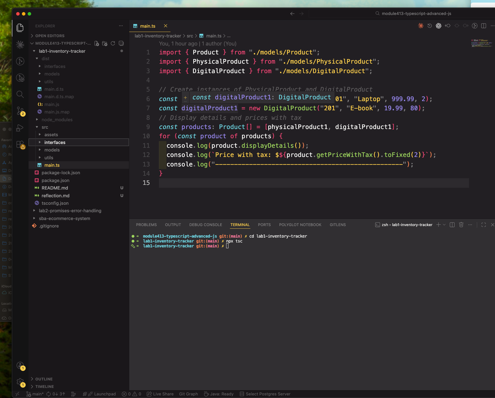
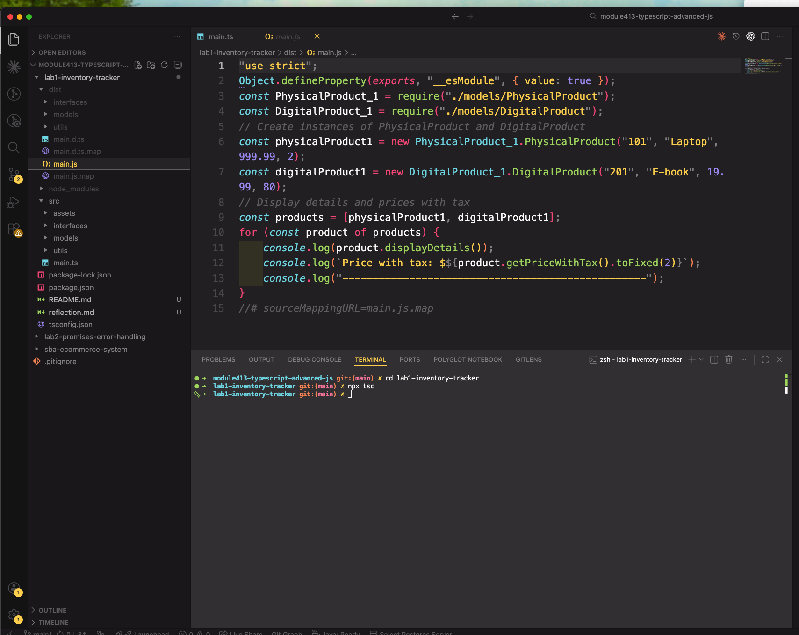
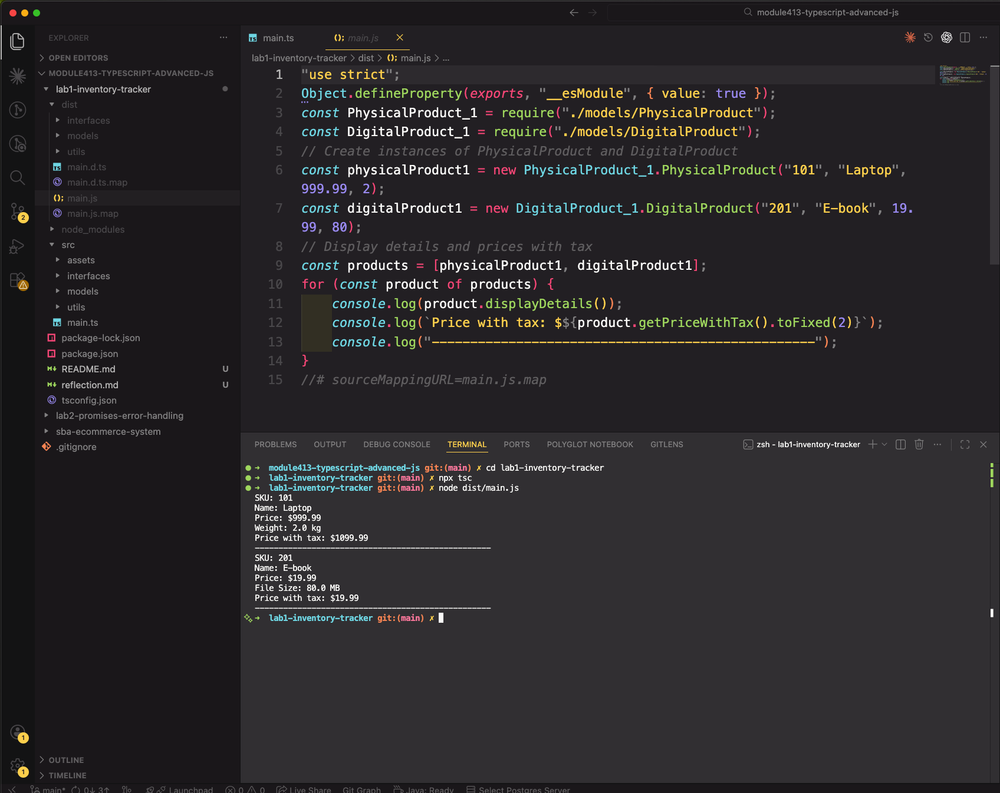

# Inventory Tracker

## Description

This project is a simple inventory tracker built with TypeScript. It uses object-oriented programming concepts such as abstraction, inheritance, polymorphism, and encapsulation to model different kinds of products. It also uses an interface to define discount behavior for selected product types.

## Features

- Abstract `Product` base class
- `PhysicalProduct` and `DigitalProduct` subclasses
- `DiscountableProduct` interface
- Discount support
- Custom `displayDetails()` methods
- Custom `getPriceWithTax()` methods

## Files

- `src/models/Product.ts` - abstract base product class
- `src/models/PhysicalProduct.ts` - physical product with weight and discount support
- `src/models/DigitalProduct.ts` - digital product with file size
- `src/utils/taxCalculator.ts` - tax utility
- `src/interface/DiscountableProduct.ts` - interface for discountable products
- `src/main.ts` - runs the program
- README.md - project overview, features, how to run the program, example output,what I learned
- reflection.md - reflection on TypeScript and object-oriented programming concepts

## How to Run

```
npm install
npx tsc
node dist/main.js
```

## Example Output





## What I Learned

This project helped me practice:

- classes and objects
- abstraction
- polymorphism
- inheritance
- encapsulation
- abstract classes
- interfaces
- method overriding
- access modifiers
- compiling TypeScript into JavaScript
