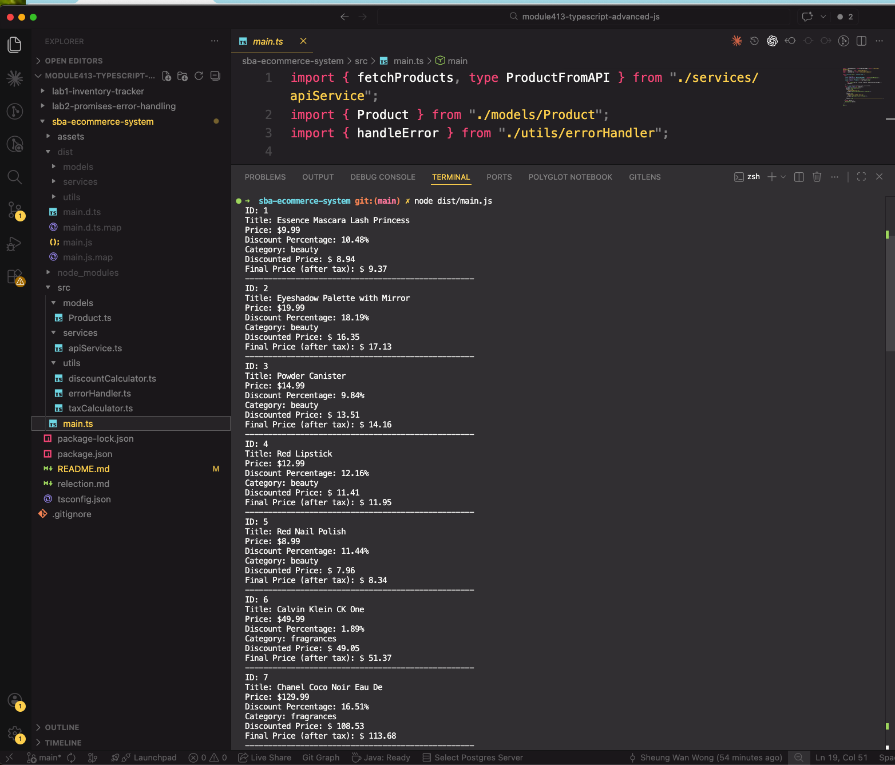
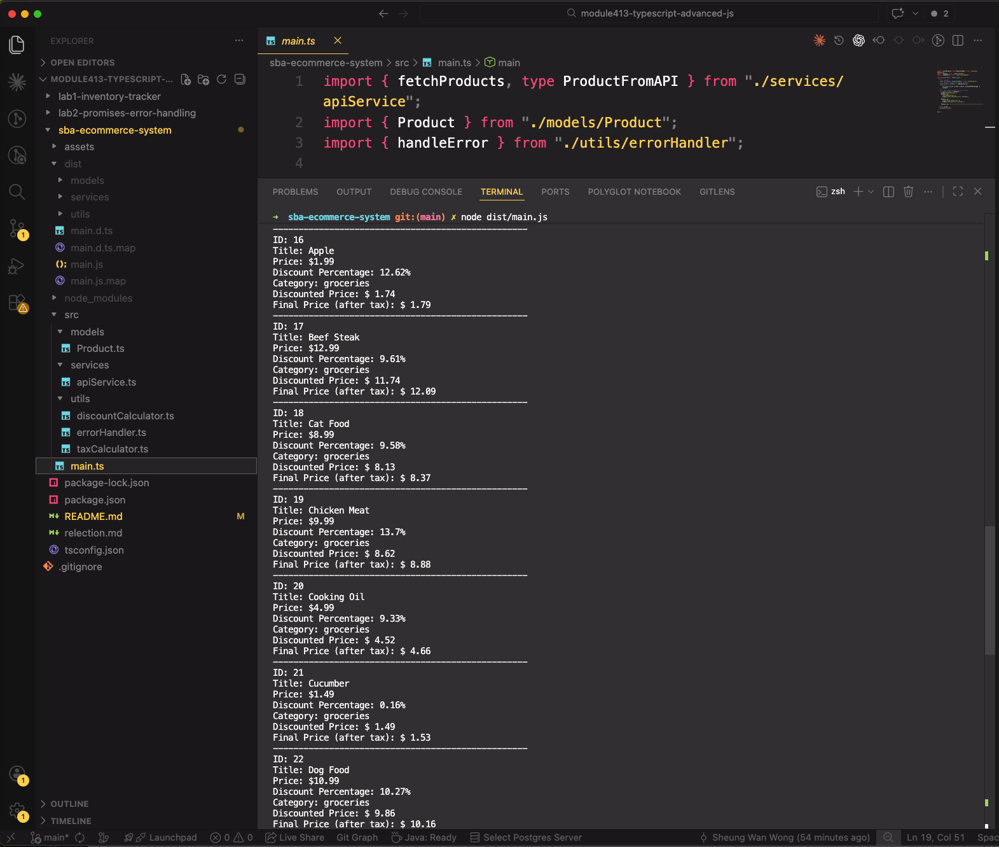

# SBA - E-commerce Product Management System

## Description

This project fetches product data from the DummyJSON API and applies discount and tax calculations using TypeScript and OOP principles.

## How to Run

```
cd sba-ecommerce-system
npm install
npx tsc
node dist/main.js
```

## Sample Output




## Reflection

See reflection.md
